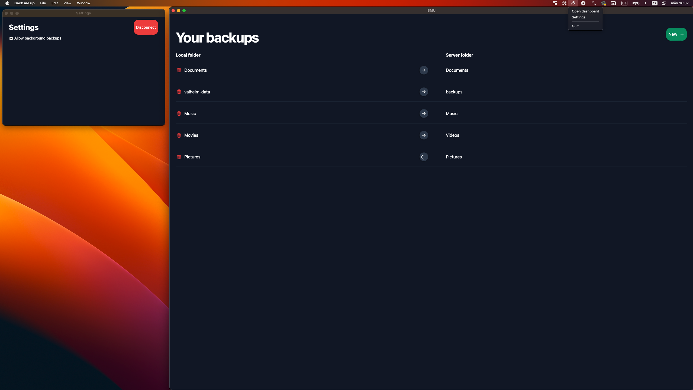

# Back Me Up
A simple tauri app that uses openssh to back up files to a remote server. This is a hobby project of mine and I'm always looking for new ways to improve it, so feel free to fork and contribute.

## 🛠️ Requirements

- Passwordless SSH key setup between client (where you will install the app) and the target backup server.
- rsync command installed on both client and server.

## 💻 Installation
Back me up is currently only available on unix platforms. Grab the [latest version from github](https://github.com/linulas/back-me-up/releases).

## ⚠️  Disclaimer
This is a work in progress and should not be viewed as a finished product. There may be bugs, missing features, and other issues. If you encounter any, please let me know. Submit your [issues to github](https://github.com/linulas/back-me-up/issues).
